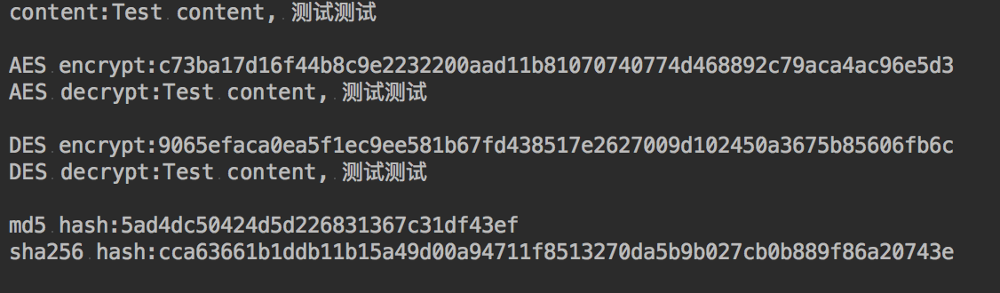

# Encrypt-java
 * Features: encrypt, decrypt, hash code, md5
 * Platform: Android, PC
 * Encrypt algorithm: DES, AES
 * Hash algorithm: MD2, MD5, SHA1, SHA256...

## Encrypt
```java
    String content = "Test content";
    String password = "password";
    String encrypted = EncryptUtil.encrypt(content, password);
```

## Encrypt
```java
    String encrypted = "c73ba17d16f44b8c9e2232200aad11b81070740774d468892c79aca4ac96e5d3";
    String password = "password";
    String decrypted = EncryptUtil.decrypt(encrypted, password);
```

## hash value (md5, sha1, sha256...)
```java
    EncryptUtil.md5("Test content");
    or
    EncryptUtil.digest("Test content", EncryptUtil.ALGORITHM.MD5);
    EncryptUtil.digest("Test content", EncryptUtil.ALGORITHM.SHA256);
```

## Test sample
```java
    String content = "Test content, 测试测试";
    String password = "password!@#";
    System.out.println("content:" + content + "\n");

    String encrypted = encrypt(content, password);
    System.out.println("AES encrypt:" + encrypted);
    System.out.println("AES decrypt:" + decrypt(encrypted, password) + "\n");

    encrypted = encrypt(content, password, ALGORITHM.DES);
    System.out.println("DES encrypt:" + encrypted);
    System.out.println("DES decrypt:" + decrypt(encrypted, password, ALGORITHM.DES) + "\n");

    System.out.println("md5 hash:" + md5(content));
    System.out.println("sha256 hash:" + digest(content, ALGORITHM.SHA256));
```

